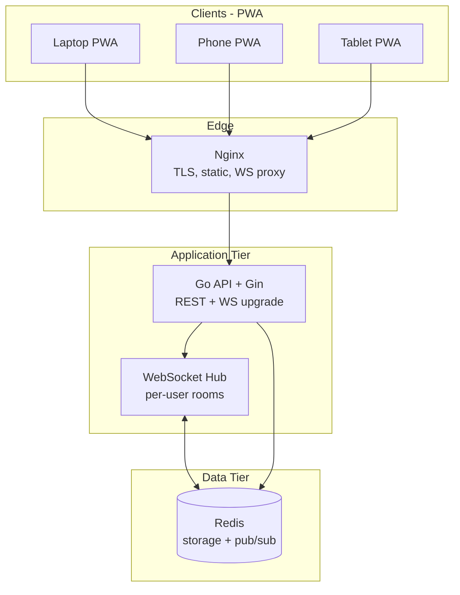

# ClipDrop — Architecture & Implementation Roadmap

Universal cross-device clipboard sync as an installable Progressive Web App (PWA). Real-time sync via WebSockets; Redis for storage, pub/sub, sessions, and TTL.

---

## 1. Full Architecture

### High-level system diagram



### Design principles

| Principle | Choice |
|-----------|--------|
| **Sync model** | Server-authoritative with optimistic UI; Redis is source of truth per user workspace |
| **Realtime** | WebSocket to owning API instance; cross-instance fan-out via Redis pub/sub |
| **Identity** | JWT anonymous sessions (no email required for MVP); optional upgrade path later |
| **Pairing** | Short-lived pairing tokens + QR payload; merges devices into one `workspace_id` |
| **Files** | Small blobs in Redis (≤256 KB) or object storage hook for MVP+; metadata always in Redis |
| **Security** | HTTPS only, rate limits, snippet TTL, optional E2E later (out of MVP scope) |
| **Offline** | Service worker caches shell + last N snippets; sync on reconnect |

### Request flows

**Clipboard copy (device A → all devices)**

1. Client detects clipboard change (or user pastes/uploads).
2. `POST /api/v1/snippets` creates snippet in Redis, publishes `snippet.created`.
3. Hub receives pub/sub message, pushes `sync.push` to all WS clients in workspace except optional `source_device_id`.
4. Other clients apply payload to local store (Zustand) and optionally write system clipboard (with permission).

**Device pairing**

1. Device A opens Pair page → `POST /api/v1/pairing/init` → receives `pairing_token` + QR URL.
2. Device B scans QR → `POST /api/v1/pairing/confirm` with token.
3. Server attaches Device B to Device A’s `workspace_id`, issues/refreshes JWT, broadcasts `device.joined`.

**Public share link**

1. User creates share → `POST /api/v1/shares` → Redis key `share:{id}` with TTL or permanent flag.
2. Anonymous visitor `GET /s/{share_id}` (nginx → API or Next.js SSR) renders read-only snippet.

### Multi-instance WebSocket scaling

```
Client WS ──► Instance A (hub)
                    │
                    ▼
              Redis PUBLISH channel:ws:{workspace_id}
                    │
        ┌───────────┼───────────┐
        ▼           ▼           ▼
   Instance A   Instance B   Instance C
        │           │           │
        └───────────┴───────────┘
              Each delivers to local connections in that workspace
```

Each connection stores: `connection_id`, `workspace_id`, `device_id`, `instance_id`.

### Frontend architecture (Next.js 15)

```
app/                    # App Router pages
components/             # UI (shadcn)
lib/                    # API client, WS client, clipboard helpers
stores/                 # Zustand (session, snippets, devices, UI)
hooks/                  # useClipboard, useWebSocket, usePairing
public/                 # manifest, icons, sw fallback assets
```

- **App Router** for dashboard, history, pair, share views.
- **Zustand** for ephemeral UI + synced snippet list (hydrate from API/WS).
- **Single WS connection** per tab with exponential backoff reconnect.
- **Clipboard API** + Permissions API; graceful degradation on iOS/Safari.

### Backend architecture (Go)

```
cmd/server/             # main
internal/
  config/               # env, validation
  middleware/           # JWT, rate limit, request ID, CORS
  handler/              # HTTP + WS handlers
  service/              # business logic
  repository/           # Redis access
  hub/                  # WebSocket hub + pub/sub bridge
  model/                # DTOs, domain types
pkg/                    # shared utilities (optional)
```

- **Handlers** thin; **services** orchestrate; **repositories** own Redis keys.
- **go_commons** for structured logging and JSON serialization (per project standards).

---

## 2. Folder Structure

```
ClipDrop/
├── docker/
│   ├── nginx/
│   │   ├── nginx.conf
│   │   └── conf.d/clipdrop.conf
│   └── redis/redis.conf
├── docs/
│   ├── ARCHITECTURE.md          # this file
│   ├── REDIS_SCHEMA.md
│   ├── API.md
│   └── WEBSOCKET_EVENTS.md
├── frontend/
│   ├── public/
│   │   ├── manifest.json
│   │   ├── icons/
│   │   └── offline.html
│   ├── src/
│   │   ├── app/
│   │   │   ├── layout.tsx
│   │   │   ├── page.tsx                 # landing / redirect
│   │   │   ├── dashboard/
│   │   │   ├── history/
│   │   │   ├── pair/
│   │   │   ├── share/[id]/
│   │   │   └── install/
│   │   ├── components/
│   │   │   ├── ui/                      # shadcn
│   │   │   ├── clipboard/
│   │   │   ├── snippet-card.tsx
│   │   │   ├── code-block.tsx
│   │   │   ├── file-dropzone.tsx
│   │   │   ├── qr-display.tsx
│   │   │   ├── qr-scanner.tsx
│   │   │   └── install-prompt.tsx
│   │   ├── lib/
│   │   │   ├── api.ts
│   │   │   ├── ws.ts
│   │   │   ├── clipboard.ts
│   │   │   └── utils.ts
│   │   ├── stores/
│   │   │   ├── session.ts
│   │   │   ├── snippets.ts
│   │   │   └── devices.ts
│   │   └── hooks/
│   ├── next.config.ts
│   ├── tailwind.config.ts
│   └── package.json
├── backend/
│   ├── cmd/server/main.go
│   ├── internal/
│   │   ├── config/
│   │   ├── middleware/
│   │   ├── handler/
│   │   ├── service/
│   │   ├── repository/
│   │   ├── hub/
│   │   └── model/
│   ├── go.mod
│   └── Dockerfile
├── docker-compose.yml
├── docker-compose.prod.yml
├── .env.example
└── README.md
```

---

## 3. Redis Schema

See [REDIS_SCHEMA.md](./REDIS_SCHEMA.md) for key patterns, TTLs, and indexes.

**Summary**

| Domain | Key pattern | Structure |
|--------|---------------|-----------|
| Session | `session:{session_id}` | Hash: workspace_id, device_id, created_at |
| JWT blocklist | `jwt:bl:{jti}` | String, TTL = token exp |
| Workspace | `ws:{workspace_id}` | Hash metadata |
| Devices | `ws:{workspace_id}:devices` | Hash device_id → JSON |
| Snippets (list) | `ws:{workspace_id}:snippets` | Sorted set (score = created_at) |
| Snippet body | `snippet:{snippet_id}` | Hash or JSON string |
| Pinned | `ws:{workspace_id}:pinned` | Set of snippet_ids |
| Pairing | `pair:{token}` | String JSON, TTL 5 min |
| Share link | `share:{share_id}` | Hash, optional TTL |
| File blob | `file:{file_id}` | Binary/string, TTL aligned with snippet |
| Presence | `presence:{workspace_id}` | Hash device_id → last_seen |
| Pub/sub | `channel:ws:{workspace_id}` | Ephemeral |
| Rate limit | `rl:{ip}:{route}` | String counter, TTL 1 min |

---

## 4. API Routes

Base: `/api/v1`  
Auth: `Authorization: Bearer <jwt>` unless noted.

### Session & health

| Method | Path | Auth | Description |
|--------|------|------|-------------|
| GET | `/health` | No | Liveness |
| GET | `/ready` | No | Redis ping |
| POST | `/session` | No | Create anonymous session + device |
| POST | `/session/refresh` | Yes | Refresh JWT |
| GET | `/session/me` | Yes | Current workspace + device |

### Devices & pairing

| Method | Path | Auth | Description |
|--------|------|------|-------------|
| GET | `/devices` | Yes | List workspace devices |
| DELETE | `/devices/:device_id` | Yes | Remove device |
| POST | `/pairing/init` | Yes | Start pairing (returns token + QR payload) |
| GET | `/pairing/:token/status` | Yes | Poll pairing status (device A) |
| POST | `/pairing/confirm` | Token in body | Device B joins workspace |
| POST | `/pairing/cancel` | Yes | Cancel open pairing |

### Snippets (clipboard)

| Method | Path | Auth | Description |
|--------|------|------|-------------|
| GET | `/snippets` | Yes | List history (cursor, limit, type filter) |
| POST | `/snippets` | Yes | Create snippet |
| GET | `/snippets/:id` | Yes | Get one |
| PATCH | `/snippets/:id` | Yes | Update (pin, title, expiry) |
| DELETE | `/snippets/:id` | Yes | Delete |
| POST | `/snippets/:id/pin` | Yes | Pin |
| DELETE | `/snippets/:id/pin` | Yes | Unpin |

### Files

| Method | Path | Auth | Description |
|--------|------|------|-------------|
| POST | `/files` | Yes | Upload (multipart, max size enforced) |
| GET | `/files/:id` | Yes | Download metadata + redirect/stream |

### Shares

| Method | Path | Auth | Description |
|--------|------|------|-------------|
| POST | `/shares` | Yes | Create public link from snippet |
| GET | `/shares/:id` | No | Public read (rate limited) |
| DELETE | `/shares/:id` | Yes | Revoke share |

### WebSocket

| Method | Path | Auth | Description |
|--------|------|------|-------------|
| GET | `/ws` | Query `?token=` or header | Upgrade to WebSocket |

---

## 5. WebSocket Events

See [WEBSOCKET_EVENTS.md](./WEBSOCKET_EVENTS.md).

**Envelope (all messages)**

```json
{
  "type": "event.name",
  "payload": {},
  "ts": 1716900000000,
  "request_id": "optional-uuid"
}
```

**Client → Server**

| Type | Purpose |
|------|---------|
| `ping` | Heartbeat |
| `subscribe` | Confirm workspace (sent after connect) |
| `snippet.push` | Fast path: create/update from client |
| `presence.update` | Active tab / foreground |
| `clipboard.ack` | Client applied remote snippet |

**Server → Client**

| Type | Purpose |
|------|---------|
| `pong` | Heartbeat reply |
| `sync.push` | New/updated snippet for workspace |
| `sync.delete` | Snippet removed |
| `device.joined` | New device paired |
| `device.left` | Device removed |
| `presence.changed` | Online devices |
| `error` | Recoverable error code + message |

---

## 6. PWA Setup Strategy

### Stack

- **next-pwa** (or `@ducanh2912/next-pwa` for Next.js 15 compatibility) wrapping Workbox.
- **Web App Manifest** in `public/manifest.json` + metadata in `app/layout.tsx`.

### Manifest essentials

- `name`, `short_name`, `description`
- `start_url`: `/dashboard`
- `display`: `standalone`
- `theme_color` / `background_color` (dark-first)
- Icons: 192, 512, maskable
- `categories`: productivity
- `shortcuts`: New clip, History, Pair device

### Service worker caching strategy

| Resource | Strategy |
|----------|----------|
| App shell (JS/CSS) | Stale-while-revalidate |
| Static assets / icons | Cache-first |
| API `/api/*` | Network-only (never cache mutations) |
| Offline fallback | `offline.html` for document navigations |

### Install prompt

- Listen for `beforeinstallprompt`; store event in Zustand.
- Custom `InstallPrompt` component on dashboard (not blocking).
- `/install` page with instructions for iOS “Add to Home Screen”.

### Clipboard & background limitations

- **No true background clipboard sync** on mobile OS; sync when app is focused or via periodic sync where supported.
- Document iOS Safari constraints in UI.
- Optional: **Periodic Background Sync** (Chrome) for pull-only check — phase 2.

### Push notifications (post-MVP)

- Web Push for “new clip on another device” — requires VAPID + service worker; defer after core sync works.

---

## 7. Docker Setup

### Services (`docker-compose.yml`)

| Service | Image | Role |
|---------|-------|------|
| `redis` | redis:7-alpine | Data + pub/sub |
| `backend` | build `./backend` | Go API + WS |
| `frontend` | build `./frontend` | Next.js standalone |
| `nginx` | nginx:alpine | Reverse proxy, TLS termination (prod) |

### Networking

- Internal network `clipdrop-net`.
- Only **nginx** exposes `80`/`443` to host.
- Backend and Redis not published in production.

### Nginx responsibilities

- `/` → frontend (Next.js)
- `/api/` → backend
- `/ws` → backend with `Upgrade` and `Connection` headers
- `client_max_body_size` for file uploads (e.g. 2m)
- Gzip/brotli for static assets

### Environment variables (`.env.example`)

```
REDIS_URL=redis://redis:6379/0
JWT_SECRET=change-me
JWT_TTL=720h
MAX_SNIPPET_SIZE=65536
MAX_FILE_SIZE=262144
RATE_LIMIT_RPM=120
CORS_ORIGINS=https://clipdrop.example
NEXT_PUBLIC_API_URL=https://clipdrop.example/api/v1
NEXT_PUBLIC_WS_URL=wss://clipdrop.example/ws
```

### Local dev variant

- `docker-compose.override.yml`: mount source, hot reload, expose backend `8080` and frontend `3000` directly for debugging.

---

## 8. Step-by-Step Implementation Plan

### Phase 0 — Foundation (Week 1)

1. Initialize monorepo folders, README, `.env.example`.
2. Docker Compose: Redis + backend skeleton + nginx stub.
3. Go: Gin server, health/ready, config, go_commons logging.
4. Redis connection pool + repository interfaces.
5. Next.js 15 + Tailwind + shadcn + dark theme tokens (Linear/Raycast aesthetic).
6. JWT session middleware + `POST /session`.

**Exit criteria:** `docker compose up` shows healthy stack; frontend loads dark shell.

### Phase 1 — Core clipboard (Week 2)

1. Snippet model + Redis CRUD + sorted history list.
2. REST: snippets CRUD, pagination, type detection (text/code/link/image/file).
3. WebSocket hub + Redis pub/sub bridge.
4. Frontend: API client, Zustand stores, dashboard list, copy buttons.
5. Manual “paste to sync” flow before auto-clipboard.

**Exit criteria:** Two browser tabs same workspace see new snippets in real time.

### Phase 2 — Pairing & multi-device (Week 3)

1. Pairing token flow + QR generation (frontend) + scanner (`html5-qrcode` or `@yudiel/react-qr-scanner`).
2. Device list API + remove device.
3. Presence in Redis + `presence.changed` events.
4. Pair page UX + dashboard device chips.

**Exit criteria:** Phone pairs with laptop via QR; both receive sync.

### Phase 3 — Rich content (Week 4)

1. Image snippets (base64 or file upload + preview).
2. Small file upload endpoint + drag/drop UI.
3. Code snippets + syntax highlight (`shiki` or `prism-react-renderer`).
4. Pin / unpin + filter pinned on dashboard.

**Exit criteria:** Image, file, and code clip types work end-to-end.

### Phase 4 — Security & sharing (Week 5)

1. Snippet expiry (Redis TTL + scheduled cleanup).
2. Public share links + public read page.
3. Rate limiting middleware (Redis sliding window).
4. Sensitive snippet flag (auto shorter TTL).

**Exit criteria:** Expiring clip disappears; share URL works unauthenticated.

### Phase 5 — PWA & polish (Week 6)

1. next-pwa, manifest, icons, offline fallback.
2. Install prompt component + iOS instructions.
3. Auto-clipboard read (where permitted) + conflict handling.
4. Clipboard history page, search/filter.
5. E2E smoke tests (Playwright): pair + sync.
6. Load test WS hub (k6 or vegeta).

**Exit criteria:** Installable PWA; offline opens cached shell; core flows tested.

### Phase 6 — Production hardening (Week 7+)

1. TLS, HSTS, security headers via nginx.
2. Structured metrics (Prometheus) + REDIS monitoring.
3. CI: lint, test, build images, push registry.
4. Staging environment + runbook.

---

## 9. Recommended Libraries

### Frontend

| Area | Library | Notes |
|------|---------|-------|
| UI | shadcn/ui + Radix | Accessible primitives |
| Styling | Tailwind CSS 4.x | Match Next 15 setup |
| State | Zustand | Lightweight, persist plugin for session id only |
| PWA | `@ducanh2912/next-pwa` | Verify Next 15 compatibility |
| QR generate | `qrcode.react` | Pairing display |
| QR scan | `html5-qrcode` | Camera scanning |
| Code highlight | `shiki` | SSR-friendly in Next |
| HTTP | native `fetch` + thin wrapper | Or `ky` if preferred |
| Dates | `date-fns` | Expiry display |
| Icons | `lucide-react` | Consistent with shadcn |
| DnD | `@dnd-kit/core` | Optional reorder history |
| File drop | `react-dropzone` | Upload UX |
| Toast | sonner (shadcn) | Feedback |

### Backend

| Area | Library | Notes |
|------|---------|-------|
| Router | `github.com/gin-gonic/gin` | |
| WebSocket | `github.com/gorilla/websocket` | |
| Redis | `github.com/redis/go-redis/v9` | |
| JWT | `github.com/golang-jwt/jwt/v5` | |
| Validation | `github.com/go-playground/validator/v10` | |
| UUID | `github.com/google/uuid` | |
| Rate limit | custom Redis or `ulule/limiter` | |
| Config | `github.com/kelseyhightower/envconfig` | |
| Log / JSON | **go_commons** `log`, `json` | Project standard |
| CORS | `github.com/gin-contrib/cors` | |
| Migrations | N/A for MVP (Redis only) | |

### Infrastructure

| Area | Library / Tool |
|------|----------------|
| Containers | Docker, Docker Compose |
| Proxy | Nginx |
| CI | GitHub Actions |
| E2E | Playwright |
| Load | k6 |

---

## 10. Production Deployment Strategy

### Target topology

```
Users → CDN (optional, static only) → Load Balancer → Nginx (×N) → Backend (×N) → Redis (primary + replica)
```

### Redis

- **Managed Redis** (ElastiCache, Upstash, Redis Cloud) with persistence AOF.
- Separate **pub/sub** connection pool from command pool.
- Memory limits + eviction policy `volatile-lru` on keys with TTL.
- For files >256 KB: migrate blobs to **S3-compatible storage**; Redis keeps pointer only.

### Backend

- Stateless containers; scale on CPU and WS connection count.
- Sticky sessions **not required** if pub/sub fan-out is correct.
- Graceful shutdown: drain WS, stop accepting, wait 30s, exit.
- Secrets from vault / platform secrets (JWT, Redis URL).

### Frontend

- `next build` with `output: 'standalone'` in Docker.
- Serve via nginx or platform (Vercel only if WS proxy to same domain is solved — self-host recommended for MVP).

### Security checklist

- TLS 1.2+, HSTS, CSP (restrict script sources).
- JWT short-ish TTL + refresh; rotate `JWT_SECRET` with dual-key window.
- Rate limits on session creation, pairing, public shares.
- Max body size on uploads; MIME sniff validation.
- No clipboard data in logs; redact in error reports.

### Observability

- **Logs:** JSON via go_commons → centralized (Loki/CloudWatch).
- **Metrics:** request latency, WS connections, Redis latency, pub/sub lag.
- **Tracing:** OpenTelemetry optional phase 2.
- **Alerts:** Redis down, error rate >1%, WS connect failures spike.

### CI/CD pipeline

1. PR: lint (eslint, golangci-lint), unit tests, build images.
2. Merge to `main`: push images to registry.
3. Deploy staging automatically; manual promote to prod.
4. DB migrations N/A; document **Redis key version** in snippet hash for future schema changes.

### Environments

| Env | Purpose |
|-----|---------|
| local | Docker Compose |
| staging | Single-node, real TLS subdomain |
| prod | Multi-backend, managed Redis, backups |

### Cost-conscious MVP

- Single VPS (4 GB): nginx + 2 backend replicas + Redis container acceptable for early users.
- Upgrade path: split Redis and app nodes when WS count > ~2k per instance.

---

## Next steps

1. Review and approve this architecture.
2. Implement **Phase 0** (scaffold + Docker + session API + frontend shell).
3. Add detailed OpenAPI spec in `docs/API.md` during Phase 1.

Related docs: [REDIS_SCHEMA.md](./REDIS_SCHEMA.md), [API.md](./API.md), [WEBSOCKET_EVENTS.md](./WEBSOCKET_EVENTS.md).
