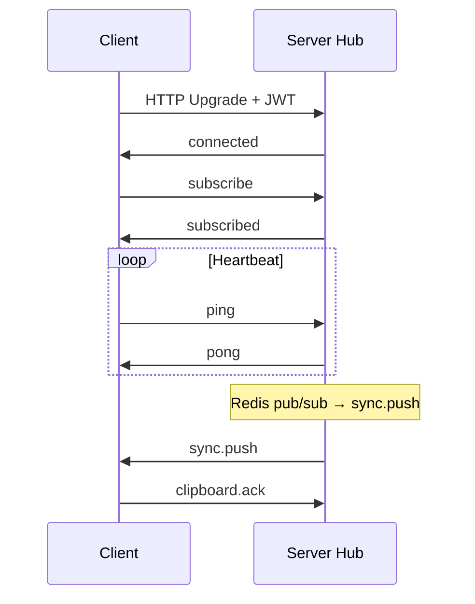

# ClipDrop — WebSocket Events

**Endpoint:** `GET /api/v1/ws?token=<jwt>`  
**Protocol:** JSON text frames  
**Heartbeat:** Client `ping` every 30s; server `pong`. Connection closed after 90s without ping.

---

## Envelope

All messages:

```json
{
  "type": "string",
  "payload": {},
  "ts": 1716900000000,
  "request_id": "optional-correlation-id"
}
```

---

## Connection lifecycle



---

## Client → Server

### `subscribe`

Sent once after connect. Confirms workspace membership.

```json
{
  "type": "subscribe",
  "payload": {
    "workspace_id": "uuid",
    "device_id": "uuid"
  }
}
```

### `ping`

```json
{ "type": "ping", "payload": {} }
```

### `snippet.push`

Optional fast path (server still validates and persists). Prefer REST for large payloads.

```json
{
  "type": "snippet.push",
  "payload": {
    "type": "text",
    "content": "synced text",
    "client_id": "local-uuid-for-dedup"
  }
}
```

Server responds with `sync.push` or `error` if duplicate `client_id` seen recently.

### `presence.update`

```json
{
  "type": "presence.update",
  "payload": { "status": "online" }
}
```

`status`: `online` | `away`

### `clipboard.ack`

Client confirms application of remote clip (analytics / debugging).

```json
{
  "type": "clipboard.ack",
  "payload": {
    "snippet_id": "uuid",
    "applied": true
  }
}
```

---

## Server → Client

### `connected`

```json
{
  "type": "connected",
  "payload": {
    "workspace_id": "uuid",
    "device_id": "uuid",
    "server_time": 1716900000000
  }
}
```

### `subscribed`

```json
{
  "type": "subscribed",
  "payload": { "workspace_id": "uuid" }
}
```

### `pong`

Response to `ping`.

### `sync.push`

Full snippet after create/update (from any device).

```json
{
  "type": "sync.push",
  "payload": {
    "snippet": { /* Snippet object */ },
    "source_device_id": "uuid"
  }
}
```

Client should skip auto-clipboard if `source_device_id` equals local device.

### `sync.delete`

```json
{
  "type": "sync.delete",
  "payload": { "snippet_id": "uuid" }
}
```

### `device.joined`

```json
{
  "type": "device.joined",
  "payload": {
    "device": {
      "id": "uuid",
      "name": "iPhone",
      "platform": "ios"
    }
  }
}
```

### `device.left`

```json
{
  "type": "device.left",
  "payload": { "device_id": "uuid" }
}
```

### `presence.changed`

```json
{
  "type": "presence.changed",
  "payload": {
    "devices": [
      { "id": "uuid", "status": "online", "last_seen_at": 1716900000000 }
    ]
  }
}
```

### `error`

```json
{
  "type": "error",
  "payload": {
    "code": "INVALID_PAYLOAD",
    "message": "Human readable",
    "recoverable": true
  }
}
```

**Codes:** `INVALID_PAYLOAD`, `UNAUTHORIZED`, `WORKSPACE_MISMATCH`, `RATE_LIMITED`, `INTERNAL`

---

## Redis → Hub (internal)

Not sent to clients directly. Pub/sub message shape:

```json
{
  "event": "sync.push",
  "workspace_id": "uuid",
  "payload": { },
  "exclude_device_id": "uuid",
  "origin_instance": "pod-name"
}
```

Hub maps `event` to client `type` and fans out to local connections.

---

## Reconnection strategy (client)

1. Exponential backoff: 1s, 2s, 4s, … max 30s.
2. On reconnect: `GET /snippets?limit=50` to reconcile missed events.
3. Dedupe by `snippet.id` + `updated_at` in Zustand store.
4. Queue outbound `snippet.push` while offline; flush on `subscribed`.

---

## Backpressure

- Max 1 inflight `snippet.push` per client.
- Server closes with code `1008` if client sends >100 messages/minute.
